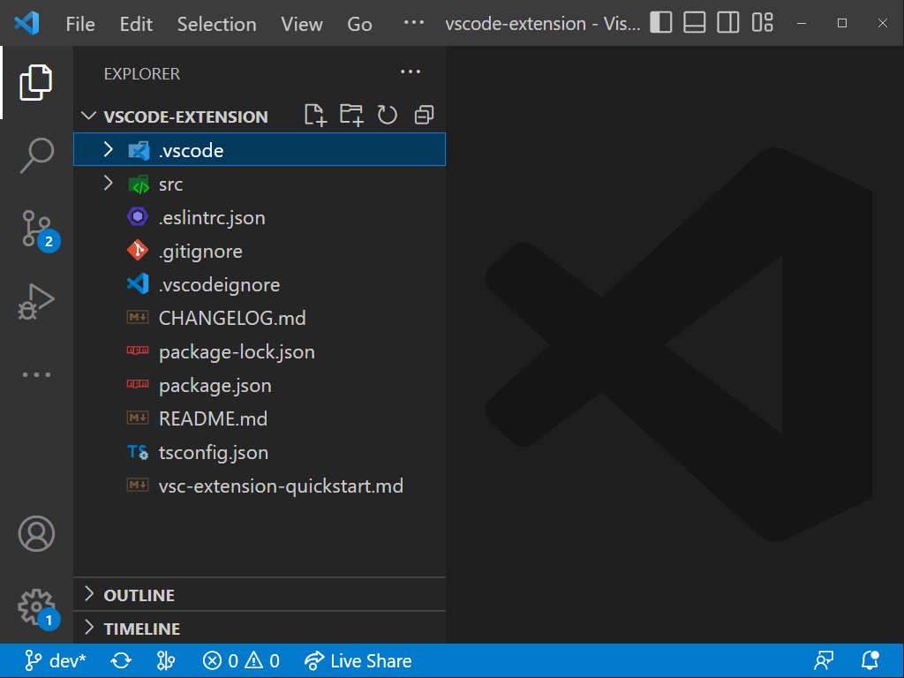
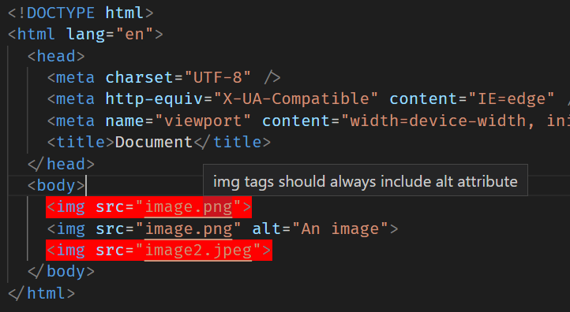

# Accessify

Accessify makes use of [Accessibility Theme Builder SDK](https://github.com/discoverfinancial/a11y-theme-builder-sdk) and [WCAG Accessibility Guidelines](https://www.w3.org/WAI/standards-guidelines/) to provide feedback to developers during development on areas where the product is failing to meet accessibility standards.

## Project Structure

Code for this project can be found within the [code folder](./code/).

The `code/cli` and `code/vscode-extension` folders contain the relevant code required to run Accessify as a **Command Line Interface (CLI)** and a **Visual Studio Code (VSCode) Extension**, repectively.

The `code/sdk` folder contains code for Accessify's **Software Development Kit (SDK)**, which serves as the backbone of the Accessify tool. It validates the user's `HTML` based on specified rules and requirements.

## Prerequisites

This project requires NodeJS (version 8 or later) and NPM.
[Node](http://nodejs.org/) and [NPM](https://npmjs.org/) are really easy to install.
To make sure you have them available on your machine,
try running the following command.

```sh
$ npm -v && node -v
```

## Installation

To use the Accessify tool, you have to first build the `Accessify SDK`. This can be achieved by following the steps below.<br/>

1. Open the project folder
1. Navigate to the `hackproject/code/sdk` folder.
1. Run the following command to install the dependencies:
   ```sh
   $ npm install
   ```
1. Build the SDK by running the following command:
   ```sh
   $ npm run build
   ```
   This will generate a `build` folder that will be used by both the CLI and the VSCode Extension.

## Usage

### Using the CLI

_The following steps assume you have opened a UNIX-based terminal_<br/>

1. Open the project folder in your terminal.
1. Navigate to the `hackproject/code/cli` folder.
1. Run the following command to install the dependencies:
   ```sh
   $ npm install
   ```
1. Set execution permission on the `./run.sh` file by using the following command, allowing it to be run as a program.
   ```sh
   $ chmod +x ./run.sh
   ```
1. Validate your required `HTML` file or entire directory based on specified options with their respective values using the following command.

   ```sh
   $ ./run.sh <path-to-file-or-directory> [options]
   ```

   **options**

   ```sh
    --css   # Specify path to a CSS file
    --validator # Specify what type of validation to use. Options: {contrast | typography | attribute | all} (default: all)
    --requirement   # Specify the type WCAG requirement to validate by {AA | AAA} (default: AA)
   ```

   **examples**

   - Validate `./static/index.html` using the default options and no other CSS file.
     ```sh
     $ ./run.sh ./static/index.html
     ```
   - Use the `contrast` validator for `./static/index.html` using the `./static/style.css`.
     ```sh
     $ ./run.sh ./static/index.html --css ./static/style.css --validator contrast
     ```
   - Validate all `HTML` files in the `./static/` directory using the WCAG AAA Requirements.
     ```sh
     $ ./run.sh ./static --requirement AAA
     ```

### Using the VSCode Extension

_The following steps assume you have already installed [VSCode](https://code.visualstudio.com/learn/get-started/basics) on your computer._

1.  Open an new VSCode window.
1.  Open the `hackproject/code/vscode-extension` folder in VSCode so that the `.vscode` folder is at the root of your VSCode workspace, as shown in the image below.<br/>
    
1.  Right-click on the **VSCode File Explorer** and select _Open in Integrated Terminal_. This should open a terminal where you can run commands.<br/>
    
1.  Ensure that **Accessify** is compatible with your VSCode by doing the following.
    - Check your VSCode version.
    - Open the `package.json` file and verify that `engines.vscode` is set to `^your-vscode-version-or-lower`. For example, if your VSCode version is` 1.78.0`, then `engines.vscode` should be set to `^1.78.0`, `^1.77.0`, `^1.73.0`, or a lower version. You can find your VSCode version by running the following command in the terminal:
      ```sh
      $ code --version
      ```
1.  Run the following command to install the dependencies:
    ```sh
    $ npm install
    ```
1.  Compile the VSCode Extension by running the following command:

    ```sh
    $ npm run compile
    ```

    At this point, please ensure that your folder structure looks like this:

    ```sh
    /
    │   .eslintrc.json
    │   .gitignore
    │   .vscodeignore
    │   CHANGELOG.md
    │   package-lock.json
    │   package.json
    │   README.md
    │   tsconfig.json
    │   vsc-extension-quickstart.md
    ├───.vscode
    ├───node_modules
    ├───out
    └───src
    ```

1.  Inside your VSCode editor, press `F5`. This will run the extension in a **new Extension Development Host window**, and you should see `Accessify is now active!` in your `DEBUG CONSOLE`.
1.  In the new Extension Development Host window, Press `Ctrl+Shift+P` to open the Command Palette.
1.  Type `Accessify` in the search box and select `Accessify` from the list of commands.
1.  If everything is set up correctly, your `HTML` file will be validated by Accessify. HTML elements in the current `.html` file with accessibility issues will be highlighted, and when you hover over them, you should see a tooltip with the issue. Here's an example image of how the output might look like:<br/>
    
