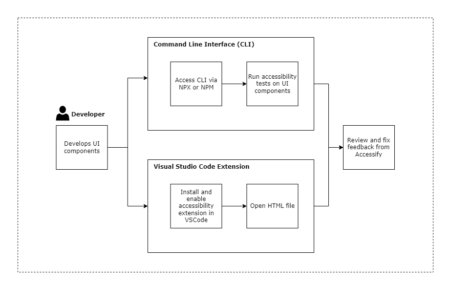
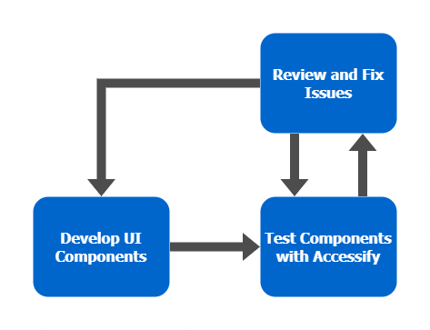
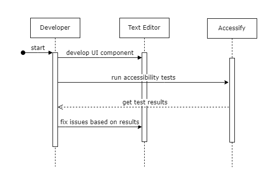

# Integrating Accessibility Testing into Development

<!--- Template Instructions  
  Update the Story Title and remove the warning below.
--->

<!--- Template Instructions  
  Organize TOC to meet needs or project
--->
#### Table of Contents
- [Integrating Accessibility Testing into Development](#use-case-story-title) 
      - [Table of Contents](#table-of-contents)
  - [Acknowledgements](#acknowledgements)
  - [Business Challenge](#business-challenge)
    - [Concept](#concept)
    - [Approach](#approach)
  - [Vernacular](#vernacular)
  - [Assumptions](#assumptions)
  - [Persona](#persona)
  - [Story](#story)
  - [Demo Workflow](#demo-workflow)

 
## Acknowledgements

<!--- Template Instructions   
  List any acknowledgements pertaining to the concepts and resources used in this use case story.
--->

This solution leverages [Accessibility Theme Builder SDK](https://github.com/discoverfinancial/a11y-theme-builder-sdk) from Discover Financial Services 
 
## Business Challenge
<!--- Template Instructions   
  Briefly describe the business challenge addressed by this use case story. Design Thinking exercises aid in the development of a clear problem statement. 
--->
Developers often find it tedious and time-consuming to test for accessibility. Accessibility testing is often done after the development and deployment stages, which results in limited feedback on the areas where the accessibility has failed. As a result, it becomes a challenge to ensure that the final product is fully accessible and meets the required standards. This challenge can potentially result in increased costs, delayed product delivery, and a negative impact on the customer experience. 
 
### Concept
<!--- Template Instructions   
  Briefly describe how this use case applies Atomic Accessibility Design to the business challenge. Leverage Design Thinking exercises to aid in this endeavor. 
--->
By integrating Accessibility Theme Builder SDK from Discover Financial Services, Accessify provides feedback to developers during development on areas where the product is failing to meet accessibility standards. By addressing accessibility issues earlier in the development process, Accessify reduces the risk of delayed product delivery, increased costs, and negative customer experiences.
 
### Approach
<!--- Template Instructions   
  Describe the end to end interactions of the stakeholders that are pertinent to this use case story. Leverage Design Thinking exercises to aid in this endeavor. 
--->

 
## Vernacular
<!--- Template Instructions   
  List and describe any terms that will be used in the story and referenced in diagrams. The current list provides a sample starter list. Leverage Design Thinking exercises to aid in the identification of use case archetypes. 
--->
 
1. **Developer**: Implements design language in software systems that generate content. Needs to be able to create accessibly inclusive renderings with ease.
 

## Assumptions
<!--- Template Instructions   
  List any assumptions to be considered in this use case story.  Leverage Design Thinking exercises to aid in this endeavor. 
--->
 
1. Developer implements user interface componenents using HTML and CSS.
 
## Persona
<!--- Template Instructions   
  Using the sample persona images in the /images/persona folder, describe the roles of the entities involved in this use case story. The current list provides a sample starter list. 
--->
 
| Actor | Role | Goals | Details |
| --- | --- | --- | --- |
|  Angelica | Developer | Needs to be able to create accessibly inclusive renderings with ease |  | |
| Accessify | Accessibility Testing Development Tool |  | |
 
## Story
<!--- Template Instructions   
  Using the sample persona images in the /images/persona folder, describe the steps that are involved in the interactive use case story. The story below is offered as an exemplar.
--->

 Angelica is a frontend developer working for a startup that is building a website for a financial institution. As part of her job, she is responsible for implementing user interface components using HTML and CSS. Angelica uses Accessify, to identify and address accessibility issues in her website earlier in the development process.

1.  Angelica develops UI components using HTML and CSS.
2.  Angelica tests her components with Accessify.
3.  Angelica reviews and fixes accessibility issues based on test feedback.
4.  Angelica repeats the process till all the components are compliant.

## Demo Workflow
<!--- Template Instructions   
  Using the sample persona images in the /images/persona folder, describe the steps of the use case story as they relate to one or more UML Sequence Diagrams.  
--->
 

 Angelica tests website's UI components with Accessify.
 

 